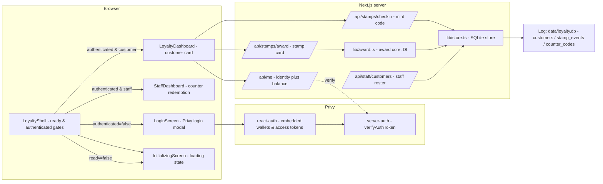
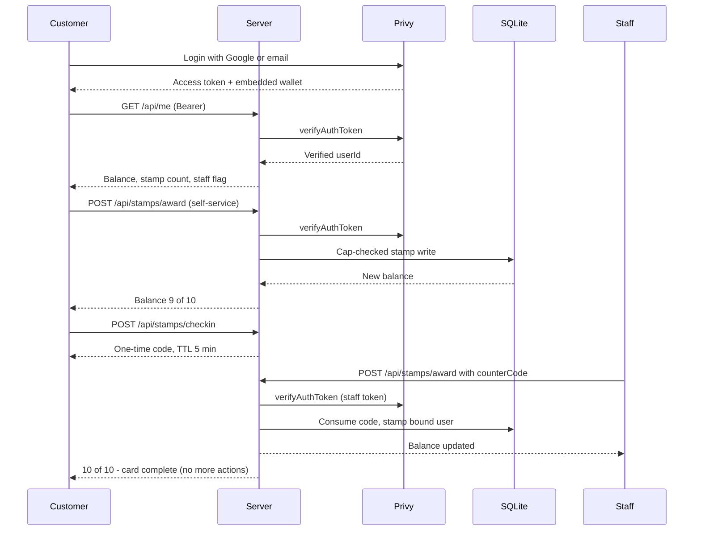

# RTD-P7 — The Loyalty Card That Can't Be Copied

A bakery loyalty card whose stamps can only ever be written against a
**server-verified Privy identity** — never against anything your browser claims
about itself. Sign in with Google or email through Privy, get an embedded
wallet bound to your login at the same moment, then collect stamps either
self-service or through a one-time counter code redeemed by staff. Buy 9
loaves, get the 10th free — and the card is hard-capped at 10 stamps by the
database itself.

> All work is confined to this `RTD-P7/` directory. No code in `RTD-P1`…`RTD-P6`
> or the repo root was modified.

## Table of Contents

- [Challenge](#challenge)
- [Features](#features)
- [Architecture](#architecture)
- [End-to-End Flow](#end-to-end-flow)
- [Technical Architecture](#technical-architecture)
- [Repository Structure](#repository-structure)
- [Scoring Criteria & Evidence](#scoring-criteria--evidence)
- [Security Model](#security-model)
- [Data Flow](#data-flow)
- [Setup](#setup)
- [Environment Variables](#environment-variables)
- [Verification](#verification)
- [Manual QA](#manual-qa)
- [Local vs Live](#local-vs-live)
- [Limitations](#limitations)
- [Challenge Completion](#challenge-completion)

## Challenge

**"The Loyalty Card That Can't Be Copied"** — Road To Devcon - III problem P7.
The stamps on a loyalty card must be unforgeable: they can only be written
against a **server-verified identity**, never against anything a browser claims
about itself (a screenshot, a forged email, a copied card). Privy owns the
identity, `verifyAuthToken` owns the trust boundary, and a strictly-capped
SQLite ledger owns the card state.

## Features

- **Real Privy login** — Google or email through the actual Privy login modal.
- **Automatic embedded wallet** — created at sign-in (`createOnLogin`).
- **Server-verified identity** — every write keys on `claims.userId`, never the request body.
- **Self-service stamping** — the customer taps *Add stamp*.
- **One-time counter codes** — minted by the customer, redeemed by staff, bound server-side.
- **Database-enforced 10-stamp cap** — can never mint an 11th stamp, even under race.
- **Staff roster** — staff emails (`STAFF_EMAILS`) get a dedicated counter view.

## Architecture



## End-to-End Flow



## Technical Architecture

| Layer | Technology | Responsibility |
| --- | --- | --- |
| Frontend | React 19 + Next.js 15 (App Router, `use client`) | `LoginScreen`, `InitializingScreen`, `LoyaltyShell`, `LoyaltyDashboard`, `StaffDashboard` |
| Auth | `@privy-io/react-auth` | login modal (Google + email), automatic embedded wallets (`createOnLogin: "users-without-wallets"`), `getAccessToken()` |
| Server auth | `@privy-io/server-auth` | `verifyAuthToken` on every server write; identity from `claims.userId` only |
| Authorization | lib-verified staff flag | `STAFF_EMAILS` env list; `isStaffMember(claims)` gating code redemption |
| Persistence | `better-sqlite3` (`data/loyalty.db`) | `customers`, `stamp_events`, `counter_codes` tables (WAL mode) |
| Wallet/blockchain | none on-chain | stamps are **application (SQLite) state**, not a blockchain ledger; the embedded wallet is identity key material |
| Award core | `lib/award.ts` (DI) | token verifier + store + staff check injected explicitly |
| Error mapping | `lib/http.ts` → `lib/client.ts` | defined status/code (`401 INVALID_TOKEN`, `409 CARD_COMPLETE`, `403 STAFF_REQUIRED`, `409 INVALID_CODE`) |

**Security boundary:** the browser is never a source of identity. `userId`,
`email` and `walletAddress` in a request body are ignored; only claims verified
server-side with real Privy key material are trusted.

## Repository Structure

```
app/
├─ api/me/route.ts            verified identity + balance
├─ api/stamps/checkin/        issue one-time counter code (refused at 10/10)
├─ api/stamps/award/          stamp a card (self-service or staff redemption)
└─ api/staff/customers/       staff roster view
components/                   LoginScreen, InitializingScreen, LoyaltyShell, dashboards
lib/                          auth, store, award core (DI), staff, client, http, deps, domain
scripts/                      check:auth (Privy env probe), normalize:stamps (data cap repair)
tests/                        unit + component + route + security tests (6 files, 37 tests)
data/                         SQLite (gitignored; .bak-* backups also gitignored)
```

## Scoring Criteria & Evidence

| Criterion | Requirement | Implementation | Evidence |
| --- | --- | --- | --- |
| P7-1 | Real Privy login method called from UI | `login({ loginMethods })` called from the sign-in `<button>` in `components/LoginScreen.tsx` (same file, `usePrivy()`) | `tests/components.test.tsx` → *P7-1 + P7-3* |
| P7-2 | Automatic wallet creation on login | `embeddedWallets.ethereum.createOnLogin: "users-without-wallets"` in `app/providers.tsx` (`PRIVY_CONFIG`) | `tests/components.test.tsx` → *P7-2* |
| P7-3 | Authenticated route gating | `components/LoyaltyShell.tsx` returns `<LoginScreen/>` until `usePrivy().authenticated`, then the dashboard | `tests/components.test.tsx` → *P7-3* "authenticated=false shows login" + "hides the dashboard until authenticated" |
| P7-4 | Explicit initialization state | `LoyaltyShell` returns `<InitializingScreen/>` while `ready === false`, before any auth logic | `tests/components.test.tsx` → *P7-4* |
| P7-5 | Server-side token verification before write | Every route calls `verifyAuthToken` via `lib/http.ts:requireAuthedToken`; `lib/award.ts` verifies first and refuses before any store write | `tests/award.test.ts` → *P7-5* invalid token 401 |
| P7-6 | Identity only from verified claims | All writes keyed on `claims.userId` or a code bound to it; body identity never read | `tests/award.test.ts` → *P7-6* body identity ignored |
| P7-7 | Client sends access token as Bearer | `getAccessToken()` → `Authorization: Bearer <token>` (`lib/client.ts`) | `tests/components.test.tsx` → *P7-7* |
| P7-8 | No credentials in tracked files | `.env*` gitignored; `.env.example` placeholder-only; secret scan test | `tests/secret-scan.test.ts` |

## Security Model

| Control | Enforcement | Purpose |
| --- | --- | --- |
| Verified identity | every server write runs `verifyAuthToken`; state keyed on `claims.userId` | the browser can never claim another card |
| One-time counter codes | issued bound to `claims.userId`; consumed inside a transaction checking `used_at` / `expires_at` | staff redeems only against the real customer |
| 10-stamp hard cap | conditional `UPDATE … WHERE balance < 10` in a transaction; rolls back on violation | an 11th stamp is impossible, even racing |
| Staff separation | `STAFF_EMAILS` gates code redemption + roster (403 `STAFF_REQUIRED`) | customers cannot redeem or read the roster |
| No unauthenticated writes | missing Bearer token → 401 before any award/checkin logic | nothing writable without a valid session |
| Secret hygiene | `.env*` gitignored; placeholder-only `.env.example`; `tests/secret-scan.test.ts` scans 32 tracked source files | credentials never enter the repository |

**Identity is the verified Privy `sub`.** Every customer gets a unique embedded
wallet at login; a screenshot or a forged email in a `fetch` body is irrelevant
— the server stamps only what a valid signed token says (`lib/award.ts`
receives just `{ token, counterCode? }`).

## Data Flow

1. **Customer** opens the app → `LoyaltyShell` renders `InitializingScreen`
   until Privy is `ready`, then `LoginScreen` until `authenticated`.
2. Sign-in mints the private embedded wallet (`createOnLogin`). `GET /api/me`
   returns the verified identity, balance, stamp count and staff flag.
3. **Self-service award** — `POST /api/stamps/award` (`{}`) verifies the token,
   pre-checks the 10 cap, then the store's conditional increment writes the
   stamp and a `stamp_events` row atomically.
4. **Counter redemption** — `POST /api/stamps/checkin` mints a 6-digit one-time
   code bound to `claims.userId` (refused at 10/10). A staff member (email in
   `STAFF_EMAILS`) redeems it via `POST /api/stamps/award` (`{ counterCode }`);
   the award writes to the **code's bound** user, with `awarded_by` and
   `via_code` recorded in `stamp_events`.
5. At 10/10 the UI removes the *Add stamp* / *Check in* paths and every further
   award returns `409 CARD_COMPLETE`.
6. `GET /api/staff/customers` lists all customers with per-card stamp counts for
   the staff roster.

## Setup

```bash
npm install
Copy-Item .env.example .env    # then fill in your values (see below)
npm run dev                    # http://localhost:3000
```

Requirements: Node.js ≥ 20.12, npm, and a free app at
<https://dashboard.privy.io> with email + Google login and embedded wallets
enabled.

```bash
npm run check:auth -- <an-access-token>   # real signature check via Privy
```

## Environment Variables

`.env` (never committed — only `.env.example` is tracked):

| Variable | Purpose | Required |
| --- | --- | --- |
| `PRIVY_APP_ID` | Server-side Privy app id | yes |
| `PRIVY_APP_SECRET` | Server-side secret (never client code) | yes |
| `NEXT_PUBLIC_PRIVY_APP_ID` | Client-side app id for the login provider | yes |
| `STAFF_EMAILS` | Comma-separated staff emails who may redeem counter codes | no |
| `DB_PATH` | SQLite path, default `data/loyalty.db` | no |
| `COUNTER_CODE_TTL_MINUTES` | Counter-code lifetime, default `5` | no |

## Verification

```bash
npm test                 # 37 tests / 6 files (unit + component + route + security)
npm run typecheck        # tsc --noEmit (clean)
npm run build            # production build (routes all ƒ dynamic)
```

| Check | Local source / test | Live Privy runtime |
| --- | --- | --- |
| P7-1…P7-8 code-level evidence | **PASS** — source inspection + 37 tests + typecheck + build | **PASS** — browser QA on `localhost:3000`: Privy login (email), authenticated dashboard, embedded-wallet creation |
| App ID correctness | **PASS** — bootstrap replay `GET auth.privy.io/api/v1/apps/{id}` returns **200** (email/Gmail/passkey/wallet methods enabled; dashboard wallets on) | **PASS** — dev server answered `200` on `/`, real session verified |
| Real `verifyAuthToken` client wiring | **PASS** — `new PrivyClient(appId, appSecret)` at `lib/auth.ts` | **PASS** — sign-in + server writes exercised in the browser |
| Sign-in modal / embedded-wallet creation | **PASS** — UI state machine tested with a mocked `usePrivy` | **PASS** — email login + automatic embedded wallet observed in browser |

The live-privy rows were recorded against the real dashboard app during the
runtime debugging and manual-QA pass; `PRIVY_APP_SECRET` remains server-only
and is never in client code.

## Manual QA

### Customer path (`localhost:3000`, no staff setup needed)

1. `npm run dev` → open `http://localhost:3000`.
2. Sign in with **Google** or **email** (Privy modal). You land on your loyalty
   card with an embedded wallet created automatically.
3. Tap **Add stamp** repeatedly. Each tap calls `POST /api/stamps/award`, and
   the dashboard updates to `1 of 10` … `10 of 10`.
4. At `10 of 10` the buttons are replaced by a **Card complete** message, a
   lunch-free-loaf tag appears, and every further award attempt is refused:
   - the UI offers no *Add stamp* / *Check in* path;
   - calling `POST /api/stamps/award` or `POST /api/stamps/checkin` directly
     with the access token returns `409 { code: "CARD_COMPLETE" }`.
5. While below 10, tap **Check in at the counter** → a 6-digit one-time code
   appears (TTL 5 min by default). It is bound server-side to your verified
   identity, so only your card receives the stamp.

### Staff path

The staff counter is **not a separate route** — it is the same sign-in flow
with an email that is listed in `STAFF_EMAILS`:

1. In `.env` set `STAFF_EMAILS=you@example.com` and restart `npm run dev`.
2. Sign out if needed, then sign in with that Google/email account (same Privy
   app). The staff dashboard renders instead of the customer card.
3. Have a customer tap **Check in at the counter**, then type their 6-digit
   code into **Redeem**. The customer's card gains a stamp (list refreshes),
   the code becomes single-use (reusing it shows `409 INVALID_CODE`), and it
   expires after the configured TTL.
4. Redeeming a code for a card that is already `10/10` shows **Card already
   complete** instead of stamping an 11th time.
5. A non-staff customer who tries to redeem a code (or hit
   `GET /api/staff/customers`) receives `403 STAFF_REQUIRED`.

## Local vs Live

| Surface | Local (this repo) | Live |
| --- | --- | --- |
| Auth, wallet creation, server writes | fully exercised by tests | **verified** end-to-end against a real Privy app (dashboard, browser session) |
| Token verification | `verifyAuthToken` wired at `lib/auth.ts` | **verified** with a real access token |
| Stamps / cap / staff flows | 37 automated tests | **verified** by the manual browser QA described above |

Everything about the loyalty card is application state; there is no live-chain
component to provision.

## Limitations

- **Stamps are not on-chain.** The embedded wallet is identity key material;
  the loyalty record lives in the app's SQLite store. Porting the card to a
  blockchain ledger is out of scope for this challenge.
- **One database, one deployment.** State is process-local SQLite — suitable
  for a single-server demo; HA/duplication is out of scope.
- **Email/Google are the only login methods.** Other Privy methods are not
  exposed in the login screen.
- **`STAFF_EMAILS` is the entire staff model** — a role table or admin console
  is out of scope.
- **Demo product number.** The "9 for 10" reward is the domain constant
  `FREE_LOAF_THRESHOLD = MAX_STAMPS_PER_CARD = 10` (`lib/domain.ts`).

## Challenge Completion

This repository satisfies **all 8 scored criteria (P7-1 … P7-8)** on the Road
To Devcon - III problem *"The Loyalty Card That Can't Be Copied"*:

- sign-in through the **real Privy** login surface (P7-1),
- **automatic embedded-wallet** creation (P7-2),
- authenticated route gating with an explicit initialization state (P7-3,
  P7-4),
- **server-side token verification** before every write (P7-5),
- identity derived **solely from verified claims** (P7-6),
- access token carried as a **Bearer** header (P7-7),
- no secrets in tracked files (P7-8)

— with **37/37 tests green**, clean `tsc --noEmit`, a successful production
build, and manual QA executed against a live Privy runtime.